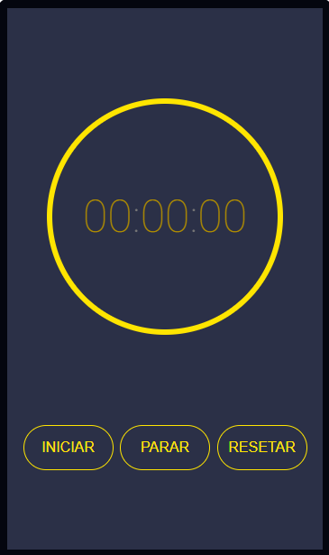
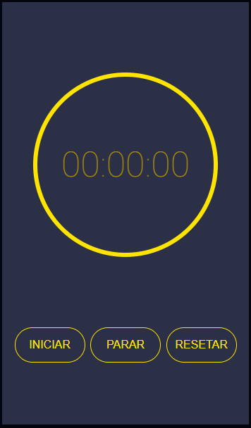

<h1 align="center">StopWatch  </h1>

## 💻 About the project
 

⏱ Stopwatch is an application to measure the amount of time between your activities .

 

## ⚙️ Functionalities

- ✅ Control your time online
- ✅ Allows start, pause, resume and reset time:
- ✅ Measures time in seconds, minutes and hours:

---

## 📱 Application Layout

 
 

---

## 🛠 Techs

Using the following technologies

- HTML
- CSS
- JavaScript

---

## 👨🏼‍💻 Autor

Fernando Augusto 

 
  
 
© 2021 GitHub, Inc.
Terms Privacy Security Status Docs